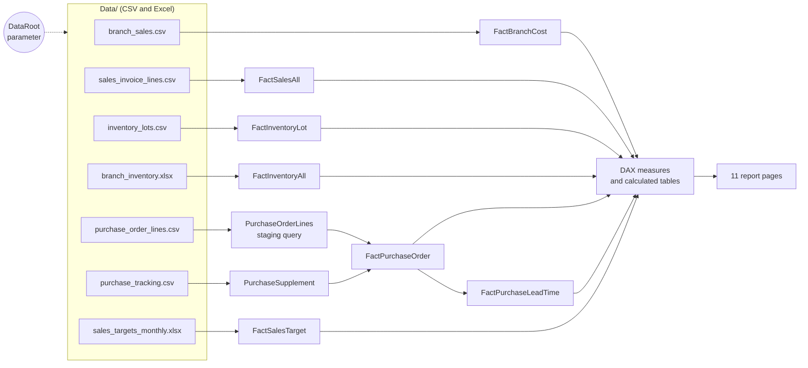

# Sales & Operations Analytics Dashboard (Power BI)

An end-to-end Power BI project for a multi-company Asian food distributor. It turns raw
ERP exports into an 11-page report covering **sales performance, sales targets, customer
grading, brand distribution, pricing and margin, inventory risk and purchasing lead times**.

The project is stored in Power BI's text-based **PBIP / TMDL** format, so every table,
relationship, DAX measure and visual is a readable file that can be reviewed in Git.

> [!IMPORTANT]
> **All data in this repository is fictional.** The company group ("Crestline"), customers,
> salespeople, suppliers, brands, products, addresses, amounts, quantities and dates were
> generated by [`tools/generate_mock_data.py`](tools/generate_mock_data.py). The files keep
> the column layout and formats of a typical ERP (Odoo) export, so every Power Query step
> and DAX measure runs exactly as it would on real data. Only US cities/states and a generic
> product category tree are real, for realism. The data is "as of" **2026-09-23**.

---

## Contents

1. [Quick start](#quick-start)
2. [Use local data instead of GitHub](#use-local-data-instead-of-github)
3. [Troubleshooting](#troubleshooting)
4. [Report pages](#report-pages)
5. [Data model](#data-model)
6. [Key analytics](#key-analytics)
7. [Data files](#data-files)
8. [About the mock data](#about-the-mock-data)
9. [Repository structure](#repository-structure)
10. [Tech stack](#tech-stack)
11. [Known limitations](#known-limitations)

---

## Quick start

**Requirements:** Windows and [Power BI Desktop](https://powerbi.microsoft.com/desktop/)
(a 2024 or later version, which opens `.pbip` projects). No database, gateway or account needed.

1. **Download the project.** Click **Code → Download ZIP** and unzip it, or run
   `git clone https://github.com/PPPPPPeter/powerbi-analytics.git`.
2. **Open `Dashboard_FakeData.pbip`** in Power BI Desktop.
3. **Load the data.** The project ships without cached data, so the visuals are empty at first.
   Click **Home → Refresh**.
4. **Answer the two one-time prompts:**
   - *Access Web content* → choose **Anonymous** → **Connect**.
   - *Privacy levels* → set every entry to **Public** → **Save**.
5. Wait for the refresh to finish (about 1–2 minutes, depending on your connection). All
   pages are now populated.

By default the model downloads the data files directly from this repository, so it works
on any computer with internet access and needs no configuration.

---

## Use local data instead of GitHub

Use this when you are offline, you have forked the repository into a private one, or you
want to try your own data files.

1. In Power BI Desktop, go to **Home → Transform data → Edit parameters**.
2. Change **DataRoot** to the full path of the `Data` folder on your computer, for example:

   ```text
   C:\Users\you\Downloads\powerbi-analytics\Data
   ```

   Do not add a trailing backslash.
3. Click **OK**, then **Apply changes**, then **Refresh**.

How it works: every query reads its file through the `DataRoot` parameter. A value that
starts with `http` is fetched as a web URL (`Web.Contents`); anything else is treated as a
local folder (`File.Contents`). To switch back, set DataRoot to:

```text
https://raw.githubusercontent.com/PPPPPPeter/powerbi-analytics/main/Data
```

> [!TIP]
> If you commit changes to this project, set DataRoot back to the GitHub URL before
> saving. Otherwise your local path is written into
> `Dashboard_FakeData.SemanticModel/definition/expressions.tmdl` and other people will
> not be able to load the data.

---

## Troubleshooting

| Symptom | Cause | Fix |
|---|---|---|
| All visuals are blank after opening | The project ships without cached data | Click **Home → Refresh** |
| `Web.Contents failed ... (404): Not Found` | The files are not at the DataRoot URL (repository renamed, private, or a different branch) | Check the URL in **Edit parameters**, or switch to [local data](#use-local-data-instead-of-github) |
| `Formula.Firewall` / "information is required about data privacy" | Privacy levels are not set | Set the data source privacy levels to **Public** (File → Options → Data source settings) |
| Asked for credentials again | Credentials were saved for a different URL level | **File → Options and settings → Data source settings**, clear the GitHub entry, refresh and choose **Anonymous** |
| Expiry status or "days since last order" look off | These use `TODAY()` and drift after the data's as-of date | Expected; regenerate the data with a newer `AS_OF` (see [About the mock data](#about-the-mock-data)) |
| Cannot open the `.pbip` file | Power BI Desktop is too old | Update Power BI Desktop |

---

## Report pages

| # | Page | English name | Question it answers | Main visuals |
|---|---|---|---|---|
| 1 | 总览 | Overview | How are sales, orders, customers and SKUs trending vs last month and last year, by company and region? | Combo trend charts, company and customer-type pie charts, map, brand contribution table |
| 2 | 品牌 - 产品 铺货情况 | Brand – product distribution | For a brand, which in-stock SKUs were actually sold this period, and which were not? | Distributed / not-distributed SKU tables, distribution rate card |
| 3 | 品牌 - 客户 铺货情况 | Brand – customer distribution | Which target customers bought a brand, which did not, and how does each salesperson cover it? | Distributed / not-distributed customer tables by salesperson |
| 4 | 产品价格 | Product pricing | How do selling price, cost and margin move over time for each product? | Price vs margin and price vs volume combo charts, product table |
| 5 | 紧急库存 | Urgent inventory | What stock has expired or will expire soon, and what might run out? | Expiry-status bar chart, batch detail and urgent-product tables |
| 6 | SKU总览 | SKU overview | What should be reordered, how much, and what is overstocked? | Five risk cards, reorder and overstock top-N charts, 13-column SKU detail table |
| 7 | 客户详情总览 | Customer detail | What is each customer's purchase history, last order date and trend? | Sales trend chart, customer detail tables |
| 8 | 客户评级 | Customer grading | Which customers are A / B / C / D, and how is each salesperson's portfolio graded? | Grade matrix by salesperson, score-detail table |
| 9 | 销售详情总览 | Sales detail | How do sales break down by salesperson, brand and category? | Bar chart, matrices, trend chart |
| 10 | 销售KPI | Sales KPI | Is each salesperson on track against the monthly target, including ice cream vs other products? | Completion gauges, target vs actual table, trend chart |
| 11 | 清泉销售总览 | Single-brand view (清泉) | How is one key brand selling, by product and by customer? | Product and customer tables |

Most pages have slicers for **company, date (year / month), product category, brand,
customer type and salesperson**.

---

## Data model

**Size:** 21 business tables, 194 DAX measures, 43 relationships (plus auto-generated date tables).



### Fact tables

| Table | Grain (one row per…) | Source file | Used for |
|---|---|---|---|
| FactBranchCost | invoice line, all companies | `branch_sales.csv` | Company sales, cost, margin, pricing, distribution, customer scoring (main fact table) |
| FactSalesAll | invoice line, accounting format | `sales_invoice_lines.csv` | Salesperson and order-creator sales for the KPI pages |
| FactInventoryLot | stock lot (batch + expiry) | `inventory_lots.csv` | On-hand stock, expiry status, near-expiry value |
| FactInventoryAll | company × SKU × expiry date | `branch_inventory.xlsx` | Stock by company for the SKU overview |
| FactPurchaseOrder | purchase order line | `purchase_order_lines.csv` + `purchase_tracking.csv` | Open quantities, in-transit stock, order status |
| FactPurchaseLeadTime | purchase order × SKU (deduplicated) | derived from FactPurchaseOrder | Actual lead-time samples and P80 lead times |
| FactSalesTarget | salesperson × month | `sales_targets_monthly.xlsx` | Monthly sales targets |

### Dimension and helper tables

`DimDate` (calendar built from the sales date range), `DimCompany`, `DimCustomerAll`,
`DimCustomerNJ`, `DimCustomerGrade`, `DimProductAll`, `ProductCatalog`, `ProductCatalogAll`,
`DimSalesperson`, `DimCreator`, `DimVisitCycle`, `DimCustomerServiceTime`, and `_Measures`
(a table that only holds report measures). Most dimensions are DAX calculated tables built
from the fact tables.

---

## Key analytics

### 1. SKU replenishment engine (`SKU总览`, `紧急库存`)

A reorder-point / order-up-to policy written entirely in DAX:

| Step | Measure | Logic |
|---|---|---|
| Daily demand | 补货日均销量 | Higher of the 30-day and 90-day average net sales (negatives set to 0) |
| Lead time | SKU补货提前期 | P80 of actual order-to-arrival days. Fallback order: the SKU's own history (≥ 5 samples) → main supplier → company-wide → 14 days |
| Safety stock | 安全库存数量 | Daily demand × 7 days |
| Reorder point | 再订货点 | Daily demand × lead time + safety stock |
| Stock position | 库存位置 | On hand + open purchase orders in transit |
| Target stock | 目标库存数量 | Daily demand × (lead time + 7 + 45 days) |
| Suggested order | 建议补货数量 | Target stock − stock position, only when stock position ≤ reorder point |
| Status | 补货状态 | No sales · stock but no sales · out of stock · out of stock with order in transit · reorder needed · normal |
| Overstock | 积压库存数量 / 金额 | Stock above 90 days of demand, valued at base cost |
| Expiry risk | 未来90天临期数量 / 金额 | Quantity and value expiring within 90 days, lot by lot |

The P80 (80th percentile) lead time protects against late deliveries without planning for
the worst case, and it is measured from purchase history instead of guessed.

### 2. Customer scoring and grading (`客户评级`)

Each customer gets a 0–100 score by comparing them with all customers of the same type
(percentile-based), with different weights for retail and wholesale:

| Component | Retail / supermarket | Wholesaler |
|---|---|---|
| Sales | 25% | 40% |
| Gross profit | 30% | 40% |
| SKU variety | 20% | – |
| Purchase frequency | 15% | 20% |
| Return performance | 10% | – |

Grade **A** ≥ 80, **B** ≥ 65, then C and D. A customer with zero or negative gross profit
cannot be graded A.

### 3. Distribution coverage (`品牌 - 产品 / 客户 铺货情况`)

For a selected brand and period: in-stock SKUs vs SKUs actually sold, target customers vs
customers who bought, and the resulting distribution rates by salesperson. This produces
ready-made target lists of customers who have never bought a brand.

### 4. Sales KPI and trends (`销售KPI`, `总览`)

Target vs actual and completion % per salesperson and per order creator; year-over-year
and month-over-month for sales, quantity and orders; ice cream and non-ice-cream
completion shown separately; conditional-formatting colours driven by measures.

---

## Data files

All files are in [`Data/`](Data). CSV files are UTF-8 with a header row.

| File | Rows | Size | Content |
|---|---:|---:|---|
| `branch_sales.csv` | 65,741 | 31 MB | Invoice lines for 5 companies: product, customer, salesperson, quantity, price, amount, base cost, gross profit |
| `sales_invoice_lines.csv` | 51,454 | 26 MB | Invoice lines in accounting-export format (invoices and refunds) for 3 companies |
| `inventory_lots.csv` | 3,428 | 0.8 MB | Stock lots with expiry date, on-hand quantity, pallet size and base cost |
| `branch_inventory.xlsx` | sheet `库存明细` | 0.1 MB | Stock by company, SKU and expiry date |
| `purchase_order_lines.csv` | 17,340 | 4.1 MB | Purchase order lines: SKU, supplier, quantity, received quantity, dates, status |
| `purchase_tracking.csv` | 5,876 | 0.4 MB | One row per purchase order: created, shipped and arrived dates |
| `sales_targets_monthly.xlsx` | sheets `KPI按月`, `原始数据` | < 0.1 MB | Monthly sales target per salesperson for 2026 |

Column names are in Chinese or English exactly as exported by the ERP system, because the
Power Query steps depend on them.

---

## About the mock data

**What is fictional:** the five companies of the "Crestline" group (New Jersey, Pacific,
Chicago, Houston, Northwest) and their warehouses, all customers (447), salespeople,
purchasing staff, suppliers (26), brands (99), products (601), prices, costs, quantities,
dates and lead times.

**What is real (for realism only):** US city and state names, and a generic product category
tree. Customer addresses contain only city and state (for example `FLUSHING, New York`), with
no street or ZIP code, so the customer map works at city level.

**Built-in patterns** so every page has something to show:

- Sales from January 2025 to 23 September 2026, with about 40% year-over-year growth.
- Strong summer seasonality for ice cream, milder seasonality for drinks.
- Ice-cream costs rise from December 2025, pushing ice-cream margin close to zero in 2026
  while other products stay near 14%.
- Refunds, discounts, freight and service-fee lines, and occasional free-of-charge lines.
- New customers (including some after 1 August 2026) and customers who stopped ordering.
- Inventory in every state: out of stock, low, normal, overstocked, no recent sales,
  expired and expiring within 90 days.
- Supplier lead times from about 3 to 75 days; roughly 5% of purchase orders still in transit.

**Regenerate the data**

```bash
pip install openpyxl
python tools/generate_mock_data.py
```

The script is seeded (`SEED = 2026`), so it produces identical files every time. Edit the
constants at the top of the script to change the output:

| Constant | Default | Effect |
|---|---|---|
| `SEED` | 2026 | Different random dataset |
| `AS_OF` | 2026-09-23 | Last sales date; expiry dates and in-transit orders are relative to it |
| `START` | 2025-01-01 | First sales date |
| `COMPANIES` | 5 companies | Customers and salespeople per company, invoice / order number prefixes |

`tools/taxonomy.json` holds the category tree and the city list the generator draws from.

---

## Repository structure

```
.
├── Dashboard_FakeData.pbip              ← open this file in Power BI Desktop
├── Dashboard_FakeData.Report/           report pages and visuals (JSON)
│   └── definition/pages/<page-id>/      one folder per page, one visual.json per visual
├── Dashboard_FakeData.SemanticModel/    data model (TMDL)
│   └── definition/
│       ├── expressions.tmdl             DataRoot parameter + staging query
│       ├── relationships.tmdl           all relationships
│       ├── model.tmdl                   model settings
│       └── tables/*.tmdl                one file per table: columns, measures, Power Query
├── Data/                                fictional source data (7 files)
├── tools/
│   ├── generate_mock_data.py            regenerates everything in Data/
│   └── taxonomy.json                    category tree and US locations
├── .gitignore                           excludes the local data cache and user settings
└── README.md
```

Measures live in the table files they belong to. Most report measures are in
`tables/_Measures.tmdl`; the replenishment logic is in `tables/DimProductAll.tmdl`; customer
scoring is in `tables/DimCustomerNJ.tmdl`; company-level sales measures are in
`tables/FactBranchCost.tmdl`.

---

## Tech stack

- **Power BI Desktop:** star-schema model, DAX measures and calculated tables, report design
- **Power Query (M):** file loading, cleaning, type conversion, merges, derived lead-time table
- **PBIP / TMDL:** text-based project format for version control
- **Python** (`csv`, `openpyxl`): mock data generation

---

## Known limitations

- **`TODAY()`-based measures** (days since last order, expiry status) drift as real time
  passes the data's as-of date. Regenerate the data with a newer `AS_OF` to reset them.
- **Online refresh downloads about 60 MB** each time. Use local data for faster refreshes.
- **Refresh in the Power BI Service** (after publishing) may need extra settings, because
  the data source URL is built from a parameter. The project is designed for Power BI Desktop.
- **Monetary values have no real-world meaning.** Targets and the ice-cream target constant
  are set to match the scale of the mock data.
